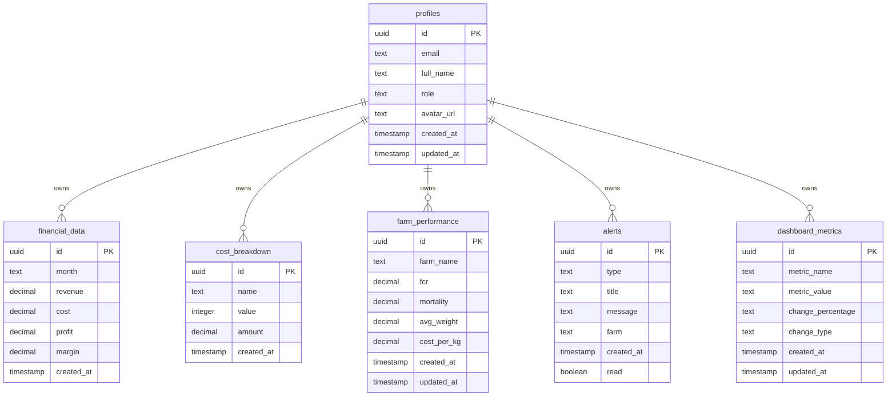

# Flockmate Database Schema Diagram

## Table Relationships

All tables are owned by the `profiles` table through Row Level Security policies. Only admin users can access all records, while regular users can only access their own data (where applicable).

## Key Constraints

1. **profiles.role** - Must be one of: 'admin', 'manager', 'operator'
2. **alerts.type** - Must be one of: 'critical', 'warning', 'info', 'success'
3. **dashboard_metrics.change_type** - Must be one of: 'positive', 'negative', 'neutral'
4. **Foreign Key** - profiles.id references auth.users.id with CASCADE DELETE